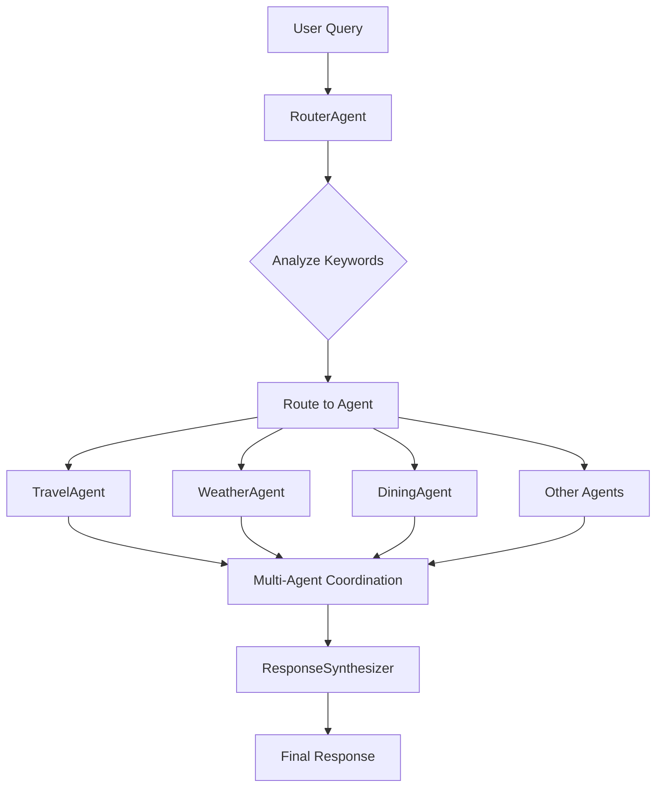

# 🤖 JSON-Configurable Multi-Agent System
## Complete Client Guide & System Overview

---

## 📋 **Table of Contents**
1. [System Overview](#-system-overview)
2. [How It Works](#-how-it-works)
3. [System Architecture](#-system-architecture)
4. [Getting Started](#-getting-started)
5. [Adding New Agents](#-adding-new-agents)
6. [Configuration Reference](#-configuration-reference)
7. [Example Queries](#-example-queries)
8. [Advanced Features](#-advanced-features)
9. [Troubleshooting](#-troubleshooting)

---

## 🌟 **System Overview**

This is a **fully JSON-configurable Multi-Agent system** built with LangGraph that allows you to create, manage, and deploy intelligent agents **without writing any Python code**. All agent configuration is done through a simple JSON file.

### **Key Benefits:**
✅ **No Coding Required** - Add agents via JSON configuration  
✅ **Instant Deployment** - Agents are loaded dynamically at runtime  
✅ **Multi-Agent Collaboration** - Agents work together automatically  
✅ **Memory Integration** - Persistent short-term and long-term memory  
✅ **Intelligent Routing** - Smart query routing to appropriate agents  
✅ **Professional Responses** - Synthesized multi-agent outputs  
✅ **Full Customization** - Complete control over agent behavior  

---

## 🔄 **How It Works**

### **End-to-End Flow:**



### **Step-by-Step Process:**

1. **📥 Query Input**: User submits a query
2. **🔍 Analysis**: RouterAgent analyzes keywords and intent
3. **🛣️ Routing**: Query routed to appropriate specialist agent(s)
4. **🤖 Processing**: Agent(s) process using custom prompts and logic
5. **🔄 Coordination**: Agents may trigger additional agents if needed
6. **🧠 Memory**: All interactions stored in short-term and long-term memory
7. **📝 Synthesis**: ResponseSynthesizer combines multi-agent outputs
8. **✨ Response**: Professional, formatted response returned

---

## 🏗️ **System Architecture**

### **Core Components:**

```
📁 System Architecture
├── 🗂️ core/agents.json           # Main configuration file
├── 🧠 LangGraphMultiAgentSystem   # Core system engine
├── 🔀 RouterAgent                 # Query routing and analysis
├── 🤖 Dynamic Agent Nodes         # Auto-generated from JSON
├── 🔗 ResponseSynthesizer         # Multi-agent response combining
├── 💾 Memory System               # STM/LTM integration
└── 🌐 API Interface               # Client interaction layer
```

### **Data Flow:**
```
JSON Config → Dynamic Loading → Agent Creation → Query Processing → Response Synthesis
```

---

## 🚀 **Getting Started**

### **Prerequisites:**
- Python 3.8+
- Ollama running locally
- Redis (for short-term memory)
- MySQL (for long-term memory)

### **Quick Start:**

1. **Start the System:**
   ```bash
   python scripts/run.py
   ```

2. **Test a Query:**
   ```python
   # The system automatically loads from core/agents.json
   response = system.process_request(
       user="client", 
       user_id=123, 
       question="Plan my vacation to Paris"
   )
   ```

3. **View Available Agents:**
   - Check `core/agents.json` to see all configured agents
   - System logs will show loaded agents on startup

---

## ➕ **Adding New Agents**

### **Simple 3-Step Process:**

#### **Step 1: Open Configuration File**
```bash
# Edit the main configuration
nano core/agents.json
```

#### **Step 2: Add Your Agent**
```json
{
  "id": "YourAgentName",
  "name": "Your Agent Display Name", 
  "description": "What your agent does",
  "capabilities": ["skill1", "skill2", "skill3"],
  "keywords": ["trigger", "words", "here"],
  "priority": 2,
  "system_prompt_template": "You are a [role]. Provide [services]. Focus on [areas]."
}
```

#### **Step 3: Restart System**
```bash
# Agents are loaded automatically on startup
python scripts/run.py
```

**That's it! Your agent is now live and ready to handle queries.**

---

## 📚 **Configuration Reference**

### **Agent Configuration Schema:**

```json
{
  "id": "string",                    // Unique agent identifier
  "name": "string",                  // Display name for responses
  "description": "string",           // Agent purpose/role
  "capabilities": ["array"],         // List of agent skills
  "keywords": ["array"],            // Trigger words for routing
  "priority": 1-5,                  // Routing priority (1=highest)
  "system_prompt_template": "string" // LLM system prompt
}
```

### **Complete Configuration Structure:**

```json
{
  "entry_point": "RouterAgent",
  "version": "2.0.0", 
  "description": "System description",
  "agents": [
    // ... array of agent objects
  ],
  "routing_rules": {
    // Agent interaction rules (optional)
  },
  "memory_settings": {
    "stm_expiry_seconds": 3600,
    "ltm_retention_days": 365,
    "max_context_items": 10
  }
}
```

### **Available Agent Templates:**

#### **🌤️ Weather Agent**
```json
{
  "id": "WeatherAgent",
  "name": "Weather Specialist",
  "keywords": ["weather", "temperature", "forecast", "rain", "sunny"],
  "system_prompt_template": "You are a meteorologist. Provide weather analysis and forecasts."
}
```

#### **✈️ Travel Agent**
```json
{
  "id": "TravelAgent", 
  "name": "Travel Specialist",
  "keywords": ["travel", "vacation", "trip", "booking", "flight", "hotel"],
  "system_prompt_template": "You are a travel agent. Provide comprehensive travel planning and booking assistance."
}
```

#### **🍽️ Dining Agent**
```json
{
  "id": "DiningAgent",
  "name": "Dining Expert", 
  "keywords": ["restaurant", "food", "dining", "cuisine", "meal"],
  "system_prompt_template": "You are a culinary expert. Provide restaurant recommendations and dining advice."
}
```

---

## 💬 **Example Queries**

### **Single Agent Queries:**
```
"What's the weather like today?"
→ Routes to: WeatherAgent

"Find me a good Italian restaurant"
→ Routes to: DiningAgent

"Plan my vacation to Tokyo" 
→ Routes to: TravelAgent
```

### **Multi-Agent Queries:**
```
"Plan a trip to Paris including weather and dining"
→ Routes to: TravelAgent → WeatherAgent → DiningAgent → ResponseSynthesizer

"Best outdoor activities considering the weather"
→ Routes to: ScenicLocationFinderAgent → WeatherAgent → ResponseSynthesizer
```

### **Response Format:**
```json
{
  "user": "client",
  "question": "Plan my vacation to Paris",
  "response": "🗺️ **Comprehensive Travel Analysis**\n\n## ✈️ Travel Specialist\n...",
  "agents_involved": ["TravelAgent", "WeatherAgent"],
  "execution_path": [...],
  "system_version": "2.0.0-multiagent"
}
```

---

## 🔧 **Advanced Features**

### **🧠 Memory System**
- **Short-Term Memory (STM)**: Recent interactions (1 hour expiry)
- **Long-Term Memory (LTM)**: Persistent user history (365 days)
- **Context Awareness**: Agents share relevant context

### **🔗 Agent Coordination**
- **Automatic Triggering**: Agents can trigger other agents
- **Context Sharing**: Weather data shared with dining recommendations
- **Smart Routing**: Priority-based keyword matching

### **📊 Response Synthesis**
- **Multi-Agent Responses**: Professional formatting with emojis
- **Execution Tracking**: Complete audit trail
- **Contextual Summaries**: Intelligent response integration

### **🎛️ Customization Options**
```json
{
  "priority": 1,              // Higher priority = processed first
  "capabilities": [...],      // Used for agent selection
  "routing_rules": {...},     // Custom inter-agent routing
  "memory_settings": {...}    // Memory behavior control
}
```

---

## 🛠️ **Troubleshooting**

### **Common Issues:**

#### **❌ Agent Not Loading**
```bash
# Check JSON syntax
python -c "import json; print(json.load(open('core/agents.json')))"

# Check system logs
tail -f logs/system.log
```

#### **❌ Query Not Routing Correctly**
- Add more specific keywords to your agent
- Check keyword priority in other agents
- Verify JSON formatting

#### **❌ Poor Response Quality**
- Improve the `system_prompt_template`
- Add more context in the prompt
- Include specific instructions and examples

### **Validation Tools:**
```bash
# Validate JSON configuration
python -c "
import json
with open('core/agents.json') as f:
    config = json.load(f)
    print(f'✅ Valid JSON with {len(config[\"agents\"])} agents')
"

# Test system loading
python -c "
from core.langgraph_multiagent_system import langgraph_multiagent_system
print(f'✅ System loaded {len(langgraph_multiagent_system.agents_config)} agents')
"
```

---

## 📞 **Support & Resources**

### **Quick References:**
- **Configuration File**: `core/agents.json`
- **System Logs**: Check console output for loading status
- **Example Agents**: See existing agents in JSON for templates
- **API Documentation**: Check `api/main.py` for endpoint details

### **Best Practices:**
✅ Use descriptive agent names and descriptions  
✅ Include comprehensive keywords for better routing  
✅ Write clear, specific system prompts  
✅ Test agents with various query types  
✅ Monitor system logs for issues  
✅ Backup configuration before major changes  

---

## 🎯 **Summary**

This JSON-configurable multi-agent system provides:

1. **Zero-Code Agent Creation** - Just edit JSON to add agents
2. **Intelligent Query Routing** - Automatic routing to the right specialists  
3. **Multi-Agent Collaboration** - Agents work together seamlessly
4. **Professional Responses** - Formatted, comprehensive outputs
5. **Memory Integration** - Context-aware conversations
6. **Easy Maintenance** - All configuration in one place

**Ready to add your first agent? Just edit `core/agents.json` and restart the system!** 🚀

---

*Last Updated: August 2025 | Version 2.0.0*
